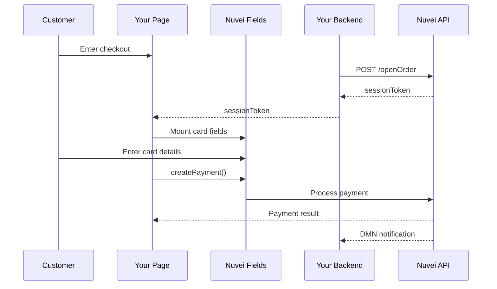

# Web SDK 1.0

Nuvei's Web SDK gives you full control over your payment page UX while remaining PCI descoped through Nuvei-hosted card fields.

<Note>
  **Status**: Stable / Production
  
  **API Backend**: REST API 1.0
</Note>

## Why Use Web SDK?

<CardGroup cols={2}>
  <Card title="PCI Descoping" icon="shield-check">
    Nuvei Fields handle card data - you're outside PCI scope
  </Card>
  <Card title="Full UX Control" icon="paintbrush">
    Embed Nuvei fields in your custom HTML
  </Card>
  <Card title="Seamless 3DS" icon="lock">
    Built-in 3D Secure handling
  </Card>
  <Card title="APM Support" icon="credit-card">
    Accept cards, wallets, and 200+ APMs
  </Card>
</CardGroup>

## When to Use Web SDK

- You need **complete control** over checkout design
- You want to build a **custom payment experience**
- You need **PCI descoping** without losing UX control
- You're building a **branded checkout** for your platform

## Live Demo

<Card title="Try the Demo" icon="play" href="https://demos.nuvei.com/websdkdemo/">
  Visit our Web SDK demo site to see it in action
</Card>

## How It Works

The Web SDK uses **Nuvei Fields** - secure IFrames that capture card data while appearing native to your page.



## Key Concepts

### Nuvei Fields
Secure, Nuvei-hosted IFrames that capture sensitive card data while appearing native to your page. They include:
- Card number field
- Expiry date field
- CVV field
- Cardholder name field (optional)

### Session Token
Every Web SDK flow starts with a `sessionToken` from `/openOrder`. This authenticates your session and stores transaction details.

### SafeCharge Object
The main SDK object that provides all payment methods:

```javascript
const safecharge = SafeCharge({
  sessionToken: '<sessionToken>',
  env: 'int', // 'int' or 'prod'
  merchantId: '<merchantId>',
  merchantSiteId: '<merchantSiteId>'
});
```

## Available Methods

| Method | Description |
|--------|-------------|
| `SafeCharge()` | Initialize the SDK |
| `createPayment()` | Process a card payment |
| `authenticate3d()` | Perform 3DS authentication |
| `getApms()` | Get available APMs |
| `createApplePayPayment()` | Process Apple Pay |
| `createGooglePayPayment()` | Process Google Pay |
| `addCardUpo()` | Tokenize a card |
| `addApmUpo()` | Save an APM |

## Integration Steps

<Steps>
  <Step title="Get Session Token (Backend)">
    Call `/openOrder` to initialize the session
  </Step>
  <Step title="Load Web SDK (Frontend)">
    Include the SDK JavaScript and initialize
  </Step>
  <Step title="Create Nuvei Fields">
    Mount secure card input fields
  </Step>
  <Step title="Process Payment">
    Call `createPayment()` when customer submits
  </Step>
  <Step title="Handle 3DS (if required)">
    SDK handles 3DS flow automatically
  </Step>
  <Step title="Verify Result">
    Confirm payment via DMN or API
  </Step>
</Steps>

## SDK Environments

| Environment | URL | Use For |
|-------------|-----|---------|
| Integration (Sandbox) | `https://cdn.safecharge.com/safecharge_resources/v1/websdk/safecharge.js` | Testing |
| Production | `https://cdn.safecharge.com/safecharge_resources/v1/websdk/safecharge.js` | Live transactions |

<Note>
  The same SDK URL is used for both environments. Set `env: 'int'` or `env: 'prod'` when initializing.
</Note>

## Quick Links

<CardGroup cols={2}>
  <Card title="Quick Start" icon="rocket" href="/integrations/web-sdk-1/quickstart">
    Get started in 15 minutes
  </Card>
  <Card title="Nuvei Fields" icon="square-code" href="/integrations/web-sdk-1/nuvei-fields">
    Customize card input fields
  </Card>
  <Card title="3D Secure" icon="lock" href="/integrations/web-sdk-1/3ds">
    Handle 3DS authentication
  </Card>
  <Card title="Digital Wallets" icon="wallet" href="/integrations/web-sdk-1/wallets">
    Apple Pay & Google Pay
  </Card>
</CardGroup>

## Web SDK 1.0 vs 2.0

| Feature | Web SDK 1.0 | Web SDK 2.0 |
|---------|------------|------------|
| **Status** | Stable (Production) | Beta |
| **API Backend** | REST API 1.0 | REST API 2.0 |
| **Authentication** | `/openOrder` → `sessionToken` | `POST /orders` → `sessionId` |
| **Nuvei Fields** | Version 1 | Version 2 (redesigned) |
| **Recommendation** | Use for production | Evaluate for new projects |

[Learn about Web SDK 2.0 →](/integrations/web-sdk-2/overview)

## Comparison with Other Integrations

| Scenario | Recommendation |
|----------|---------------|
| Full control over checkout UX | ✅ **Web SDK** |
| Quick launch, embedded checkout | ❌ Use Simply Connect |
| Minimal development effort | ❌ Use Payment Page |
| Server-to-server only (PCI Level 1) | ❌ Use REST API |

## Next Steps

<Steps>
  <Step title="Get Credentials">
    Obtain your credentials from the [Control Panel](https://sandbox.nuvei.com/settings/my_payment_settings)
  </Step>
  <Step title="Follow Quick Start">
    Complete the [Quick Start guide](/integrations/web-sdk-1/quickstart)
  </Step>
  <Step title="Customize Fields">
    Style [Nuvei Fields](/integrations/web-sdk-1/nuvei-fields) to match your brand
  </Step>
  <Step title="Add Payment Methods">
    Integrate [Apple Pay](/integrations/web-sdk-1/wallets), [Google Pay](/integrations/web-sdk-1/wallets), and APMs
  </Step>
</Steps>
