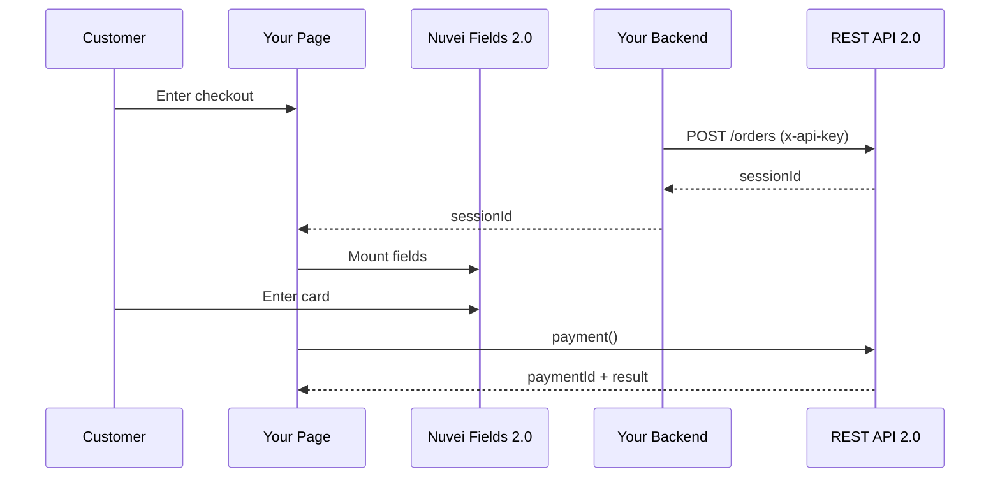

# Web SDK 2.0

Web SDK 2.0 is the next-generation JavaScript SDK built on REST API 2.0, offering a simplified integration experience.

<Warning>
  **Status**: Beta
  
  Web SDK 2.0 is currently in beta. For production deployments, consider [Web SDK 1.0](/integrations/web-sdk-1/overview).
</Warning>

## Why Web SDK 2.0?

<CardGroup cols={2}>
  <Card title="Simplified Authentication" icon="key">
    API key header instead of session checksums
  </Card>
  <Card title="Modern API" icon="bolt">
    RESTful design with `paymentId` lifecycle
  </Card>
  <Card title="Nuvei Fields 2.0" icon="square-code">
    Redesigned secure card fields
  </Card>
  <Card title="Better DX" icon="code">
    Cleaner SDK methods and responses
  </Card>
</CardGroup>

## Key Differences from Web SDK 1.0

| Feature | Web SDK 1.0 | Web SDK 2.0 |
|---------|------------|------------|
| **API Backend** | REST API 1.0 | REST API 2.0 |
| **Session Init** | `POST /openOrder` | `POST /orders` |
| **Auth Method** | `checksum` calculation | `x-api-key` header |
| **Session ID** | `sessionToken` | `sessionId` |
| **Payment ID** | Multiple IDs | Single `paymentId` |
| **SDK Object** | `SafeCharge()` | `webSDK()` |

## How It Works



## Integration Steps

<Steps>
  <Step title="Create Order (Backend)">
    Call `POST /orders` with API key to get `sessionId`
  </Step>
  <Step title="Load SDK 2.0 (Frontend)">
    Import the Web SDK 2.0 library
  </Step>
  <Step title="Initialize Nuvei Fields 2.0">
    Mount secure card input fields
  </Step>
  <Step title="Process Payment">
    Call `payment()` method
  </Step>
  <Step title="Handle Result">
    Use `paymentId` to track the transaction
  </Step>
</Steps>

## Quick Example

### Backend: Create Order

```javascript
// Node.js example
const axios = require('axios');

async function createOrder(amount, currency) {
  const response = await axios.post(
    'https://api-sandbox.nuvei.com/orders',
    {
      processingEntityId: '<your processing entity ID>',
      amount,
      currency,
      merchantDetails: {
        customField1: 'order_123'
      }
    },
    {
      headers: {
        'Content-Type': 'application/json',
        'x-api-key': '<your API key>'
      }
    }
  );
  
  return response.data.sessionId;
}
```

### Frontend: Initialize SDK

```html
<script src="https://cdn.nuvei.com/websdk/2.0/nuvei.js"></script>

<script>
  // Initialize Web SDK 2.0
  const nuvei = webSDK({
    sessionId: '<sessionId from backend>',
    env: 'sandbox' // 'sandbox' or 'production'
  });
  
  // Create Nuvei Fields 2.0
  const fields = nuvei.fields();
  
  // Card Number
  const cardNumber = fields.create('cardNumber');
  cardNumber.mount('#card-number');
  
  // Expiry
  const expiry = fields.create('expirationDate');
  expiry.mount('#expiry');
  
  // CVV
  const cvv = fields.create('cvv');
  cvv.mount('#cvv');
</script>
```

### Frontend: Process Payment

```javascript
async function pay() {
  try {
    const result = await nuvei.payment({
      paymentMethod: {
        type: 'card',
        card: {
          cardNumber,
          expirationDate: expiry,
          cvv
        }
      },
      billingAddress: {
        email: 'customer@email.com',
        country: 'US'
      }
    });
    
    if (result.status === 'approved') {
      console.log('Payment successful!', result.paymentId);
    } else {
      console.log('Payment failed:', result.reason);
    }
  } catch (error) {
    console.error('Error:', error);
  }
}
```

## Available Methods

| Method | Description |
|--------|-------------|
| `webSDK()` | Initialize the SDK |
| `fields()` | Create field instances |
| `payment()` | Process a payment |
| `fields.create()` | Create individual secure fields |

## Supported Payment Methods

- **Cards** - Visa, Mastercard, Amex, etc.
- **Apple Pay** - Native Apple Pay integration
- **Google Pay** - Native Google Pay integration
- **ACH** - US bank transfers
- **Payment Tokens** - Previously saved cards

## Quick Links

<CardGroup cols={2}>
  <Card title="Quick Start" icon="rocket" href="/integrations/web-sdk-2/quickstart">
    Get started with SDK 2.0
  </Card>
  <Card title="Nuvei Fields 2.0" icon="square-code" href="/integrations/web-sdk-2/fields">
    Secure card field components
  </Card>
  <Card title="REST API 2.0" icon="code" href="/rest-2/introduction">
    Backend API documentation
  </Card>
  <Card title="Migration Guide" icon="arrow-right" href="/integrations/web-sdk-2/migration">
    Migrate from SDK 1.0
  </Card>
</CardGroup>

## When to Use SDK 2.0

<Tabs>
  <Tab title="Use SDK 2.0 If...">
    - You're starting a **new project** and want modern architecture
    - You prefer **API key authentication** over checksums
    - You want to use **REST API 2.0** features
    - You're comfortable with **beta software**
  </Tab>
  <Tab title="Use SDK 1.0 If...">
    - You need **production stability**
    - You have an **existing REST API 1.0** integration
    - You need features not yet in SDK 2.0
    - You require **full APM support** (SDK 2.0 has limited APMs)
  </Tab>
</Tabs>

## REST API 2.0 Resources

Web SDK 2.0 is powered by REST API 2.0. Learn more:

<CardGroup cols={2}>
  <Card title="REST 2.0 Introduction" icon="book" href="/rest-2/introduction">
    Overview of the new API
  </Card>
  <Card title="Authentication" icon="key" href="/rest-2/authentication">
    API key authentication
  </Card>
  <Card title="Payments Guide" icon="credit-card" href="/rest-2/guides/cards/non-3ds">
    Process card payments
  </Card>
  <Card title="API Reference" icon="code" href="/api-reference/overview">
    Endpoint documentation
  </Card>
</CardGroup>
