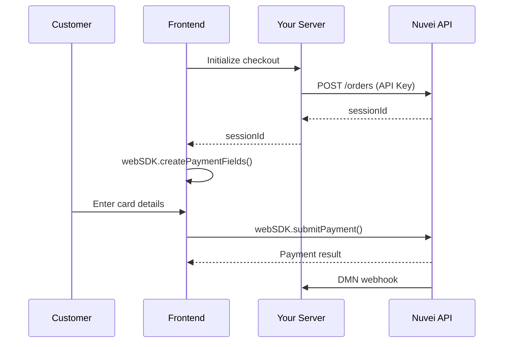

# Web SDK 2.0 Quick Start

<Note>
  **Beta Product**: Web SDK 2.0 is currently in beta. For production use, consider [Web SDK 1.0](/integrations/web-sdk-1/quickstart).
</Note>

Build a custom checkout with Web SDK 2.0 and REST API 2.0 backend.

## Prerequisites

- REST API 2.0 credentials (API Key)
- Modern browser (Chrome, Firefox, Safari, Edge)

## Integration Flow



## Step 1: Create Order (Backend)

Create an order using REST API 2.0:

<CodeGroup>
```javascript Node.js
const axios = require('axios');

async function createOrder(orderData) {
  const response = await axios.post(
    'https://api-sandbox.nuvei.com/orders',
    {
      currency: 'USD',
      amount: orderData.amount,
      items: orderData.items,
      consumer: {
        firstName: orderData.customer.firstName,
        lastName: orderData.customer.lastName,
        email: orderData.customer.email
      }
    },
    {
      headers: {
        'Content-Type': 'application/json',
        'x-api-key': process.env.NUVEI_API_KEY
      }
    }
  );
  
  return response.data.sessionId;
}

// Express endpoint
app.post('/api/create-order', async (req, res) => {
  try {
    const sessionId = await createOrder(req.body);
    res.json({ sessionId });
  } catch (error) {
    res.status(500).json({ error: error.message });
  }
});
```

```php PHP
<?php
function createOrder($orderData) {
    $apiKey = getenv('NUVEI_API_KEY');
    
    $payload = [
        'currency' => 'USD',
        'amount' => $orderData['amount'],
        'items' => $orderData['items'],
        'consumer' => [
            'firstName' => $orderData['customer']['firstName'],
            'lastName' => $orderData['customer']['lastName'],
            'email' => $orderData['customer']['email']
        ]
    ];
    
    $ch = curl_init('https://api-sandbox.nuvei.com/orders');
    curl_setopt($ch, CURLOPT_RETURNTRANSFER, true);
    curl_setopt($ch, CURLOPT_POST, true);
    curl_setopt($ch, CURLOPT_POSTFIELDS, json_encode($payload));
    curl_setopt($ch, CURLOPT_HTTPHEADER, [
        'Content-Type: application/json',
        'x-api-key: ' . $apiKey
    ]);
    
    $response = curl_exec($ch);
    curl_close($ch);
    
    $data = json_decode($response, true);
    return $data['sessionId'];
}
?>
```
</CodeGroup>

## Step 2: Initialize Web SDK (Frontend)

<Steps>
  <Step title="Include the SDK">
    Add the Web SDK 2.0 script to your page:
    
    ```html
    <script src="https://cdn.nuvei.com/websdk/2.0/nuvei.js"></script>
    ```
  </Step>
  
  <Step title="Create HTML placeholders">
    Add containers for the payment fields:
    
    ```html
    <div id="checkout-form">
      <div id="card-number"></div>
      <div id="card-expiry"></div>
      <div id="card-cvc"></div>
      <button id="pay-button" type="button">Pay</button>
    </div>
    ```
  </Step>
  
  <Step title="Initialize the SDK">
    Initialize with your session ID:
    
    ```javascript
    let nuveiSDK;
    
    async function initCheckout() {
      // Get session from your backend
      const response = await fetch('/api/create-order', {
        method: 'POST',
        headers: { 'Content-Type': 'application/json' },
        body: JSON.stringify({
          amount: 100.00,
          items: [{ name: 'Product', quantity: 1, price: 100.00 }],
          customer: {
            firstName: 'John',
            lastName: 'Smith',
            email: 'john@example.com'
          }
        })
      });
      
      const { sessionId } = await response.json();
      
      // Initialize Web SDK
      nuveiSDK = webSDK({
        sessionId: sessionId,
        env: 'sandbox' // 'production' for live
      });
      
      // Create payment fields
      const fields = nuveiSDK.createPaymentFields();
      
      fields.cardNumber.mount('#card-number');
      fields.cardExpiry.mount('#card-expiry');
      fields.cardCvc.mount('#card-cvc');
    }
    
    initCheckout();
    ```
  </Step>
</Steps>

## Step 3: Submit Payment

Handle the payment submission:

```javascript
document.getElementById('pay-button').addEventListener('click', async () => {
  const button = document.getElementById('pay-button');
  button.disabled = true;
  button.textContent = 'Processing...';
  
  try {
    const result = await nuveiSDK.submitPayment({
      billingAddress: {
        firstName: 'John',
        lastName: 'Smith',
        email: 'john@example.com',
        country: 'US'
      }
    });
    
    if (result.status === 'APPROVED') {
      // Payment successful
      showSuccess(result);
    } else {
      // Payment failed
      showError(result.errorMessage || 'Payment failed');
    }
  } catch (error) {
    showError(error.message);
  } finally {
    button.disabled = false;
    button.textContent = 'Pay';
  }
});

function showSuccess(result) {
  document.getElementById('checkout-form').innerHTML = `
    <div class="success">
      <h2>Payment Successful!</h2>
      <p>Transaction ID: ${result.transactionId}</p>
    </div>
  `;
}

function showError(message) {
  alert('Payment Error: ' + message);
}
```

## Complete Example

```html
<!DOCTYPE html>
<html lang="en">
<head>
  <meta charset="UTF-8">
  <meta name="viewport" content="width=device-width, initial-scale=1.0">
  <title>Web SDK 2.0 Checkout</title>
  <style>
    .payment-form {
      max-width: 400px;
      margin: 40px auto;
      padding: 20px;
      font-family: -apple-system, BlinkMacSystemFont, sans-serif;
    }
    
    .field-container {
      margin-bottom: 15px;
    }
    
    .field-container label {
      display: block;
      margin-bottom: 5px;
      font-weight: 500;
      color: #333;
    }
    
    .nuvei-field {
      border: 1px solid #ddd;
      border-radius: 4px;
      padding: 12px;
      background: white;
    }
    
    .nuvei-field:focus-within {
      border-color: #6366f1;
      box-shadow: 0 0 0 3px rgba(99, 102, 241, 0.1);
    }
    
    .pay-button {
      width: 100%;
      padding: 14px;
      background: #6366f1;
      color: white;
      border: none;
      border-radius: 6px;
      font-size: 16px;
      font-weight: 600;
      cursor: pointer;
      margin-top: 20px;
    }
    
    .pay-button:disabled {
      background: #9ca3af;
      cursor: not-allowed;
    }
    
    .pay-button:hover:not(:disabled) {
      background: #4f46e5;
    }
    
    .success {
      text-align: center;
      padding: 40px;
    }
    
    .success h2 {
      color: #10b981;
    }
    
    .error {
      color: #ef4444;
      margin-top: 10px;
      font-size: 14px;
    }
  </style>
</head>
<body>
  <div class="payment-form">
    <h1>Checkout</h1>
    <p>Total: $100.00</p>
    
    <div id="checkout-form">
      <div class="field-container">
        <label>Card Number</label>
        <div id="card-number" class="nuvei-field"></div>
      </div>
      
      <div style="display: flex; gap: 15px;">
        <div class="field-container" style="flex: 1;">
          <label>Expiry</label>
          <div id="card-expiry" class="nuvei-field"></div>
        </div>
        
        <div class="field-container" style="flex: 1;">
          <label>CVC</label>
          <div id="card-cvc" class="nuvei-field"></div>
        </div>
      </div>
      
      <button id="pay-button" class="pay-button">Pay $100.00</button>
      
      <div id="error-message" class="error"></div>
    </div>
  </div>
  
  <script src="https://cdn.nuvei.com/websdk/2.0/nuvei.js"></script>
  <script>
    let nuveiSDK;
    
    async function initCheckout() {
      try {
        // Get session from your backend
        const response = await fetch('/api/create-order', {
          method: 'POST',
          headers: { 'Content-Type': 'application/json' },
          body: JSON.stringify({
            amount: 100.00,
            items: [{ name: 'Product', quantity: 1, price: 100.00 }],
            customer: {
              firstName: 'John',
              lastName: 'Smith',
              email: 'john@example.com'
            }
          })
        });
        
        const { sessionId } = await response.json();
        
        // Initialize Web SDK
        nuveiSDK = webSDK({
          sessionId: sessionId,
          env: 'sandbox'
        });
        
        // Create and mount fields
        const fields = nuveiSDK.createPaymentFields({
          style: {
            base: {
              fontSize: '16px',
              color: '#333',
              '::placeholder': {
                color: '#999'
              }
            }
          }
        });
        
        fields.cardNumber.mount('#card-number');
        fields.cardExpiry.mount('#card-expiry');
        fields.cardCvc.mount('#card-cvc');
        
        // Handle field events
        fields.cardNumber.on('change', (event) => {
          if (event.error) {
            document.getElementById('error-message').textContent = event.error.message;
          } else {
            document.getElementById('error-message').textContent = '';
          }
        });
        
      } catch (error) {
        document.getElementById('error-message').textContent = error.message;
      }
    }
    
    document.getElementById('pay-button').addEventListener('click', async () => {
      const button = document.getElementById('pay-button');
      const errorDiv = document.getElementById('error-message');
      
      button.disabled = true;
      button.textContent = 'Processing...';
      errorDiv.textContent = '';
      
      try {
        const result = await nuveiSDK.submitPayment({
          billingAddress: {
            firstName: 'John',
            lastName: 'Smith',
            email: 'john@example.com',
            country: 'US'
          }
        });
        
        if (result.status === 'APPROVED') {
          document.getElementById('checkout-form').innerHTML = `
            <div class="success">
              <h2>✓ Payment Successful!</h2>
              <p>Transaction ID: ${result.transactionId}</p>
              <p>Thank you for your purchase.</p>
            </div>
          `;
        } else {
          errorDiv.textContent = result.errorMessage || 'Payment was declined. Please try again.';
          button.disabled = false;
          button.textContent = 'Pay $100.00';
        }
      } catch (error) {
        errorDiv.textContent = error.message;
        button.disabled = false;
        button.textContent = 'Pay $100.00';
      }
    });
    
    // Initialize on page load
    initCheckout();
  </script>
</body>
</html>
```

## Test Cards

Use these test cards in sandbox:

| Card Number | Brand | Scenario |
|-------------|-------|----------|
| 4111111111111111 | Visa | Success |
| 5111111111111118 | Mastercard | Success |
| 4000000000000002 | Visa | Declined |

- Expiry: Any future date (e.g., 12/2030)
- CVV: Any 3 digits (e.g., 123)

## Customization

### Styling Fields

```javascript
const fields = nuveiSDK.createPaymentFields({
  style: {
    base: {
      fontSize: '16px',
      fontFamily: 'Inter, sans-serif',
      color: '#1f2937',
      fontWeight: '400',
      '::placeholder': {
        color: '#9ca3af'
      }
    },
    invalid: {
      color: '#ef4444'
    },
    complete: {
      color: '#10b981'
    }
  }
});
```

### Field Events

```javascript
fields.cardNumber.on('ready', () => {
  console.log('Card number field ready');
});

fields.cardNumber.on('focus', () => {
  // Add visual focus indicator
});

fields.cardNumber.on('blur', () => {
  // Remove focus indicator
});

fields.cardNumber.on('change', (event) => {
  if (event.complete) {
    // Field is complete
  }
  if (event.error) {
    // Show error
  }
});
```

## Next Steps

<CardGroup cols={2}>
  <Card title="3D Secure" icon="shield" href="/integrations/features/3ds">
    Handle 3DS authentication
  </Card>
  <Card title="APMs" icon="wallet" href="/apms/overview">
    Add alternative payment methods
  </Card>
  <Card title="Tokenization" icon="key" href="/integrations/features/tokenization">
    Save payment methods
  </Card>
  <Card title="Webhooks" icon="bell" href="/integrations/features/webhooks">
    Handle payment notifications
  </Card>
</CardGroup>
