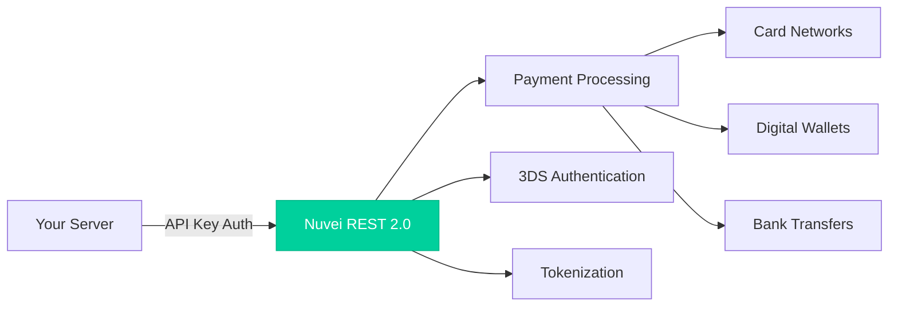

# Welcome to REST API 2.0

Nuvei's REST API 2.0 is a modern, developer-friendly server-to-server integration that enables you to process payments globally with simplicity and power.

<Note>
  **Beta Release** - REST API 2.0 is currently in beta. We're actively gathering feedback to make it even better.
</Note>

## Why REST 2.0?

<CardGroup cols={2}>
  <Card title="Modern RESTful Design" icon="code">
    True REST conventions with proper HTTP methods, intuitive endpoints, and predictable responses
  </Card>
  <Card title="Simpler Authentication" icon="key">
    Single API key in header—no more checksums or complex signature calculations
  </Card>
  <Card title="Streamlined Workflows" icon="route">
    Reduced complexity with payment lifecycle IDs that link all related operations
  </Card>
  <Card title="Developer Experience" icon="laptop-code">
    OpenAPI/YAML specs, better error messages, and comprehensive sandbox testing
  </Card>
</CardGroup>

## Quick Example

Process a payment in just one API call:

```bash
curl -X POST https://api-sandbox.nuvei.com/payment-api/payments \
  -H "Content-Type: application/json" \
  -H "x-api-key: YOUR_API_KEY" \
  -d '{
    "processingEntityId": "YOUR_PROCESSING_ENTITY_ID",
    "transactionType": "Sale",
    "amount": 100,
    "currency": "USD",
    "paymentOption": {
      "card": {
        "cardNumber": "4761344136141390",
        "cardHolderName": "John Smith",
        "expirationMonth": "12",
        "expirationYear": "2027",
        "cvv": "123"
      }
    },
    "deviceDetails": {
      "ipAddress": "192.168.1.1"
    }
  }'
```

## Get Started

<CardGroup cols={2}>
  <Card
    title="What's New"
    icon="sparkles"
    href="/whats-new"
  >
    See what's different in REST 2.0
  </Card>
  <Card
    title="Quickstart"
    icon="rocket"
    href="/quickstart"
  >
    Your first payment in 5 minutes
  </Card>
  <Card
    title="Authentication"
    icon="lock"
    href="/authentication"
  >
    Set up your API credentials
  </Card>
  <Card
    title="API Reference"
    icon="book"
    href="/api-reference/overview"
  >
    Explore all endpoints
  </Card>
</CardGroup>

## Payment Methods Supported

<CardGroup cols={3}>
  <Card title="Cards" icon="credit-card" href="/guides/cards/non-3ds">
    Visa, Mastercard, Amex with optional 3DS
  </Card>
  <Card title="Apple Pay" icon="apple" href="/guides/wallets/apple-pay">
    Seamless mobile payments
  </Card>
  <Card title="Google Pay" icon="google" href="/guides/wallets/google-pay">
    One-tap checkout
  </Card>
  <Card title="ACH" icon="building-columns" href="/guides/bank/ach">
    US bank transfers
  </Card>
  <Card title="Refunds" icon="rotate-left" href="/guides/operations/refunds">
    Full and partial refunds
  </Card>
  <Card title="Tokenization" icon="database" href="/guides/cards/tokenization">
    Secure card storage
  </Card>
</CardGroup>

## Architecture Overview



## Need Help?

<CardGroup cols={2}>
  <Card title="Developer Support" icon="headset" href="https://support.nuvei.com">
    Get help from our integration team
  </Card>
  <Card title="API Status" icon="signal" href="https://status.nuvei.com">
    Check system status and uptime
  </Card>
</CardGroup>
