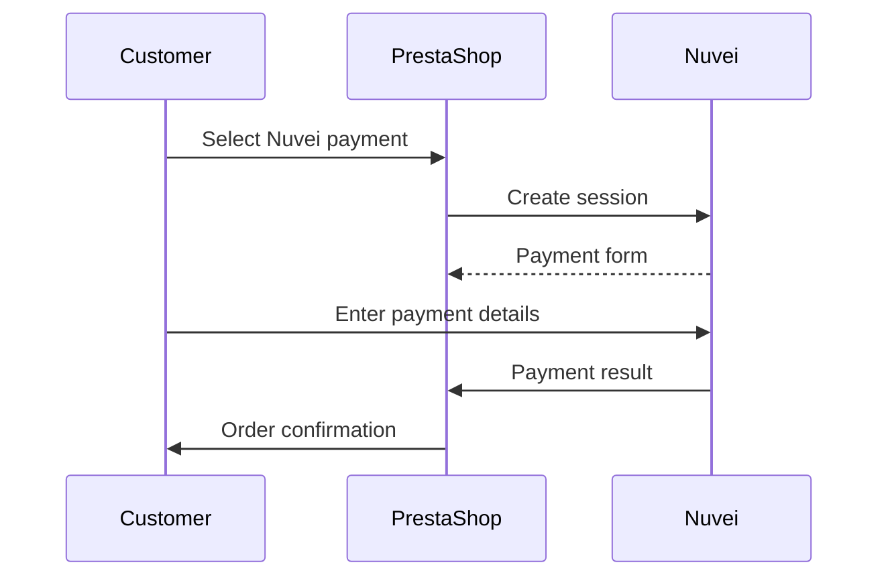

# PrestaShop Plugin

<Info>
  **Platform:** PrestaShop 1.7+ / 8.x  
  **Plugin Version:** 3.x  
  **Integration Type:** Redirect, Hosted Fields, Apple/Google Pay  
  **Support:** Full payment lifecycle
</Info>

Integrate Nuvei payments into your PrestaShop store with our official module supporting all major payment methods and features.

## Features

<CardGroup cols={2}>
  <Card title="All Payment Methods" icon="credit-card">
    Cards, APMs, wallets, BNPL
  </Card>
  <Card title="3D Secure 2" icon="shield">
    PCI-compliant authentication
  </Card>
  <Card title="One-Click Payment" icon="bolt">
    Saved cards for returning customers
  </Card>
  <Card title="Multi-store" icon="store">
    Different configs per store
  </Card>
</CardGroup>

## Requirements

- PrestaShop 1.7.6+ or 8.x
- PHP 7.2+
- SSL certificate
- Nuvei merchant account

## Installation

### From PrestaShop Marketplace

1. Go to **Modules** → **Module Catalog**
2. Search for "Nuvei"
3. Click **Install**

### Manual Installation

1. Download the module from Nuvei
2. Extract to `/modules/nuvei/`
3. Go to **Modules** → **Module Manager**
4. Find "Nuvei" and click **Install**

## Configuration

### Basic Settings

1. Navigate to **Modules** → **Nuvei** → **Configure**
2. Enter your credentials:

| Setting | Description |
|---------|-------------|
| Merchant ID | Your Nuvei merchant ID |
| Merchant Site ID | Your site ID |
| Secret Key | API secret key |
| Environment | Production or Sandbox |

### Payment Methods

Configure which methods to display:

| Option | Description |
|--------|-------------|
| Credit Cards | Visa, MC, Amex, etc. |
| APMs | Local payment methods |
| Digital Wallets | Apple Pay, Google Pay |
| BNPL | Klarna, Afterpay |

### Transaction Settings

| Setting | Options |
|---------|---------|
| Transaction Type | Auth or Sale |
| Auto Capture | Yes/No |
| 3D Secure | Force, Auto |

## Checkout Flow

## Order Management

### Capture Payments

For authorized transactions:

1. Go to **Orders** → Select order
2. Click **Capture** in Nuvei panel
3. Enter amount (full or partial)

### Refunds

1. Go to **Orders** → Select order
2. Click **Refund** in Nuvei panel
3. Enter refund amount

### Void

Cancel authorized (uncaptured) transactions:

1. Go to **Orders** → Select order
2. Click **Void** in Nuvei panel

## Multi-Store Configuration

Configure different settings per store:

1. Go to **Shop Parameters** → **General**
2. Select store context
3. Configure Nuvei separately

## Webhooks

Webhooks are automatically configured. Manual setup:

| Setting | Value |
|---------|-------|
| URL | `https://yourstore.com/module/nuvei/callback` |
| Events | All payment events |

## Testing

1. Set Environment to **Sandbox**
2. Use test cards from Nuvei documentation
3. Complete test transactions
4. Verify orders in PrestaShop admin

### Test Cards

| Card | Number | Result |
|------|--------|--------|
| Visa | 4000 0000 0000 1026 | Approved |
| Visa 3DS | 4000 0000 0000 1091 | 3DS required |

## Troubleshooting

<AccordionGroup>
  <Accordion title="Payment methods not showing" icon="eye-slash">
    - Check API credentials
    - Verify method enabled in Nuvei portal
    - Check currency/country restrictions
  </Accordion>
  
  <Accordion title="3D Secure issues" icon="shield">
    - Verify 3DS enabled in Nuvei portal
    - Check browser popup blockers
    - Test with different 3DS test card
  </Accordion>
  
  <Accordion title="Webhook errors" icon="webhook">
    - Verify webhook URL accessible
    - Check SSL certificate valid
    - Review PrestaShop error logs
  </Accordion>
</AccordionGroup>

## Support

<CardGroup cols={2}>
  <Card title="Documentation" icon="book" href="https://docs.nuvei.com">
    Full API docs
  </Card>
  <Card title="Support" icon="headset" href="https://support.nuvei.com">
    Technical support
  </Card>
</CardGroup>
