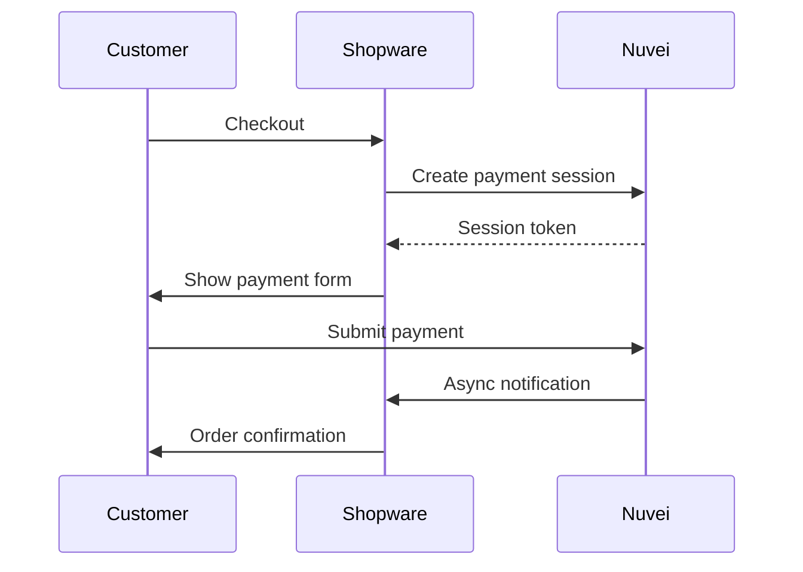

# Shopware 6 Plugin

<Info>
  **Platform:** Shopware 6.4+  
  **Plugin Version:** 2.x  
  **Integration Type:** Embedded, Redirect  
  **Support:** Full payment lifecycle
</Info>

Integrate Nuvei payments into your Shopware 6 store with our official plugin supporting all payment methods and enterprise features.

## Features

<CardGroup cols={2}>
  <Card title="Payment Methods" icon="credit-card">
    Cards, APMs, BNPL, wallets
  </Card>
  <Card title="3D Secure 2" icon="shield">
    SCA-compliant authentication
  </Card>
  <Card title="Subscriptions" icon="repeat">
    Recurring payment support
  </Card>
  <Card title="B2B Commerce" icon="building">
    Enterprise features support
  </Card>
</CardGroup>

## Requirements

- Shopware 6.4+
- PHP 8.0+
- SSL certificate
- Nuvei merchant account

## Installation

### From Shopware Store

1. Go to **Extensions** → **My extensions**
2. Search for "Nuvei"
3. Click **Add extension**
4. Install and activate

### Via Composer

```bash
composer require nuvei/shopware6-plugin
bin/console plugin:refresh
bin/console plugin:install --activate NuveiPayment
bin/console cache:clear
```

## Configuration

Navigate to **Settings** → **Plugins** → **Nuvei Payment**

### API Settings

| Setting | Description |
|---------|-------------|
| Merchant ID | Your Nuvei merchant ID |
| Merchant Site ID | Your site ID |
| Secret Key | API secret key |
| Environment | Production / Sandbox |

### Payment Configuration

| Setting | Description |
|---------|-------------|
| Transaction Mode | Authorize / Capture |
| Allowed Methods | Select payment methods |
| 3D Secure | Auto / Force |
| Hosted Fields | Enable/Disable |

### Sales Channel Configuration

Configure per sales channel:

1. Go to **Sales Channels** → Select channel
2. Go to **Payment methods**
3. Enable Nuvei methods

## Payment Flow



## Order Management

### From Admin Panel

1. Go to **Orders** → Select order
2. View Nuvei transaction details
3. Actions available:
   - **Capture** - Capture authorized amount
   - **Refund** - Full or partial refund
   - **Cancel** - Void authorization

### Via API

Shopware Admin API supports Nuvei operations:

```bash
POST /api/_action/nuvei/capture/{orderId}
POST /api/_action/nuvei/refund/{orderId}
POST /api/_action/nuvei/cancel/{orderId}
```

## Rule Builder Integration

Create rules based on payment method:

1. Go to **Settings** → **Rule Builder**
2. Create rule with condition "Payment method"
3. Use for shipping, promotions, etc.

## Flow Builder Integration

Automate payment workflows:

```
Trigger: Order placed
Condition: Payment method = Nuvei
Action: Send custom email / Tag customer / etc.
```

## Subscriptions

For Shopware Subscriptions:

1. Enable recurring in Nuvei portal
2. Configure subscription products
3. Nuvei handles recurring billing

## Testing

1. Set Environment to **Sandbox**
2. Use Nuvei test cards
3. Process test orders
4. Verify in Shopware admin

## Troubleshooting

<AccordionGroup>
  <Accordion title="Payment methods not visible" icon="eye-slash">
    - Check sales channel configuration
    - Verify API credentials
    - Clear Shopware cache
  </Accordion>
  
  <Accordion title="Webhook issues" icon="webhook">
    - Verify webhook URL in Nuvei portal
    - Check server firewall
    - Review Shopware logs
  </Accordion>
  
  <Accordion title="Plugin conflicts" icon="plug">
    - Disable other payment plugins
    - Check theme compatibility
    - Update Shopware to latest
  </Accordion>
</AccordionGroup>

## Support

<CardGroup cols={2}>
  <Card title="Documentation" icon="book" href="https://docs.nuvei.com">
    Full API docs
  </Card>
  <Card title="Shopware Community" icon="comments" href="https://community.shopware.com">
    Community support
  </Card>
</CardGroup>
