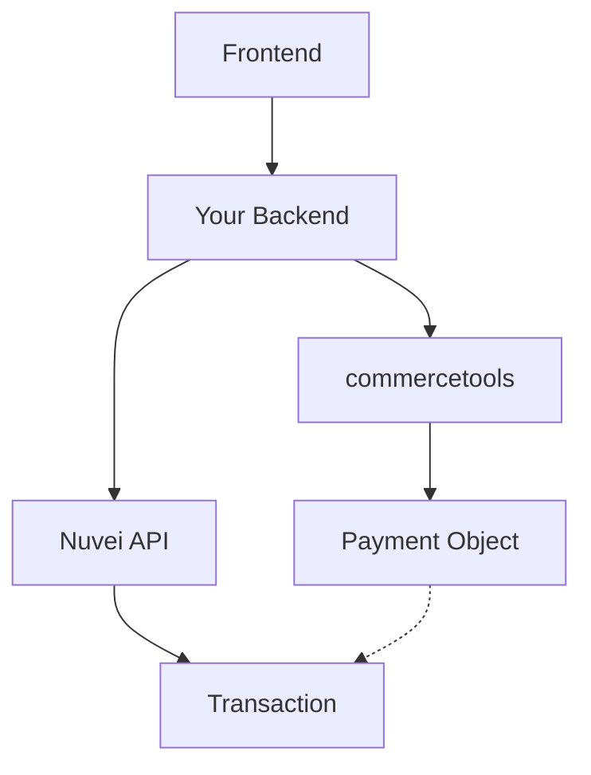

# commercetools Integration

<Info>
  **Platform:** commercetools  
  **Type:** Connect application / Custom integration  
  **Architecture:** Headless / API-first  
  **Support:** Full payment features
</Info>

Integrate Nuvei payments with commercetools for headless commerce implementations, supporting all frontend frameworks and channels.

## Features

<CardGroup cols={2}>
  <Card title="Headless Ready" icon="code">
    Works with any frontend
  </Card>
  <Card title="Payment API" icon="credit-card">
    Native commercetools payments
  </Card>
  <Card title="Multi-channel" icon="devices">
    Web, mobile, POS, IoT
  </Card>
  <Card title="Event-driven" icon="bolt">
    Subscriptions & extensions
  </Card>
</CardGroup>

## Architecture



## Integration Approach

### Option 1: Connect Application

Use Nuvei Connect app from commercetools Marketplace:

1. Go to **Settings** → **Connect**
2. Install Nuvei connector
3. Configure credentials

### Option 2: Custom Integration

Build custom integration using commercetools Payment API:

```javascript
// Create payment
const payment = await apiRoot
  .payments()
  .post({
    body: {
      amountPlanned: {
        currencyCode: 'USD',
        centAmount: 9999
      },
      paymentMethodInfo: {
        paymentInterface: 'Nuvei',
        method: 'CreditCard'
      }
    }
  })
  .execute();
```

## Payment Flow

### 1. Create Payment Object

```javascript
const payment = {
  amountPlanned: {
    currencyCode: 'USD',
    centAmount: 9999
  },
  paymentMethodInfo: {
    paymentInterface: 'Nuvei',
    method: 'CreditCard'
  },
  custom: {
    type: { key: 'nuvei-payment-type' },
    fields: {
      nuveiSessionToken: sessionToken
    }
  }
};
```

### 2. Process with Nuvei

```javascript
// Your backend service
async function processPayment(payment) {
  // Get session token
  const session = await nuvei.getSessionToken();
  
  // Process payment
  const result = await nuvei.payment({
    sessionToken: session.sessionToken,
    amount: payment.amountPlanned.centAmount / 100,
    currency: payment.amountPlanned.currencyCode,
    // ... payment details
  });
  
  return result;
}
```

### 3. Update Payment Object

```javascript
// Add transaction
await apiRoot
  .payments()
  .withId({ ID: payment.id })
  .post({
    body: {
      version: payment.version,
      actions: [{
        action: 'addTransaction',
        transaction: {
          type: 'Authorization',
          amount: payment.amountPlanned,
          interactionId: nuveiResult.transactionId,
          state: 'Success'
        }
      }]
    }
  })
  .execute();
```

## Extensions & Subscriptions

### Payment Extension

Create extension for payment processing:

```javascript
// Extension handler
exports.handler = async (event) => {
  const payment = event.resource.obj;
  
  if (payment.paymentMethodInfo.paymentInterface === 'Nuvei') {
    // Process with Nuvei
    const result = await processWithNuvei(payment);
    
    return {
      actions: [{
        action: 'addTransaction',
        transaction: {
          type: 'Authorization',
          state: result.success ? 'Success' : 'Failure',
          interactionId: result.transactionId,
          amount: payment.amountPlanned
        }
      }]
    };
  }
};
```

### Payment Subscription

Subscribe to payment events:

```javascript
// Subscribe to payment changes
const subscription = {
  destination: {
    type: 'HTTP',
    url: 'https://your-service.com/webhooks'
  },
  messages: [{
    resourceTypeId: 'payment',
    types: ['PaymentCreated', 'PaymentStatusChanged']
  }]
};
```

## Custom Types

Define custom type for Nuvei data:

```json
{
  "key": "nuvei-payment-type",
  "name": { "en": "Nuvei Payment" },
  "resourceTypeIds": ["payment"],
  "fieldDefinitions": [
    {
      "name": "nuveiTransactionId",
      "type": { "name": "String" },
      "label": { "en": "Nuvei Transaction ID" }
    },
    {
      "name": "nuveiAuthCode",
      "type": { "name": "String" },
      "label": { "en": "Auth Code" }
    }
  ]
}
```

## Frontend Integration

### React Example

```jsx
import { useState } from 'react';

function NuveiCheckout({ cart }) {
  const [sessionToken, setSessionToken] = useState(null);
  
  useEffect(() => {
    // Get session token from your backend
    fetch('/api/nuvei/session', {
      method: 'POST',
      body: JSON.stringify({ cartId: cart.id })
    })
    .then(res => res.json())
    .then(data => setSessionToken(data.sessionToken));
  }, [cart.id]);
  
  return (
    <div id="nuvei-checkout">
      {sessionToken && (
        <NuveiHostedFields 
          sessionToken={sessionToken}
          onSuccess={handleSuccess}
        />
      )}
    </div>
  );
}
```

## Order Management

### Capture

```javascript
async function capturePayment(payment, amount) {
  // Capture in Nuvei
  const nuveiResult = await nuvei.settle({
    relatedTransactionId: payment.custom.fields.nuveiTransactionId,
    amount,
    currency: payment.amountPlanned.currencyCode,
    authCode: payment.custom.fields.nuveiAuthCode
  });
  
  // Update commercetools
  await apiRoot.payments().withId({ ID: payment.id }).post({
    body: {
      version: payment.version,
      actions: [{
        action: 'addTransaction',
        transaction: {
          type: 'Charge',
          state: 'Success',
          amount: { centAmount: amount * 100, currencyCode: 'USD' },
          interactionId: nuveiResult.transactionId
        }
      }]
    }
  }).execute();
}
```

## Testing

1. Use commercetools sandbox project
2. Configure Nuvei sandbox credentials
3. Test payment flows end-to-end

## Best Practices

<AccordionGroup>
  <Accordion title="Idempotency" icon="repeat">
    Use commercetools payment ID as Nuvei clientUniqueId for idempotent requests.
  </Accordion>
  
  <Accordion title="State management" icon="database">
    Store Nuvei transaction details in payment custom fields for reconciliation.
  </Accordion>
  
  <Accordion title="Error handling" icon="triangle-exclamation">
    Handle Nuvei errors and update payment state appropriately.
  </Accordion>
</AccordionGroup>

## Support

<CardGroup cols={2}>
  <Card title="Nuvei Docs" icon="book" href="https://docs.nuvei.com">
    API documentation
  </Card>
  <Card title="commercetools Docs" icon="cloud" href="https://docs.commercetools.com">
    commercetools documentation
  </Card>
</CardGroup>
