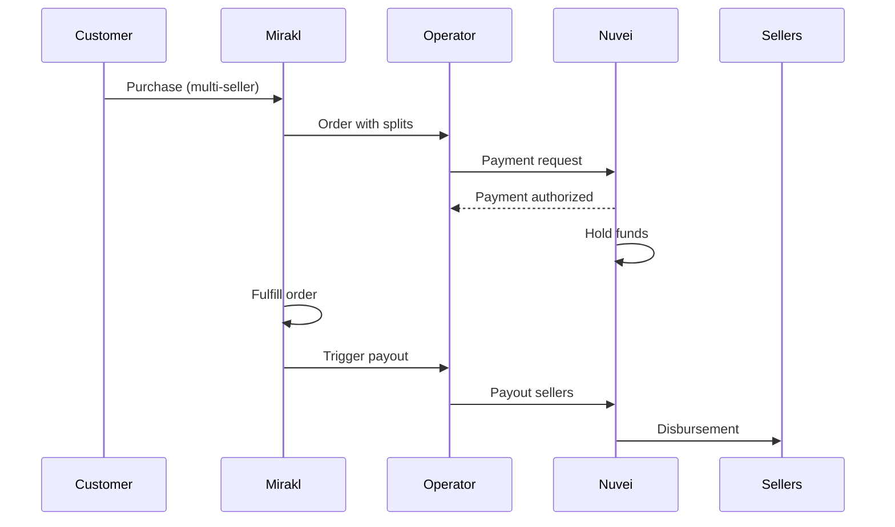

# Mirakl Integration

<Info>
  **Platform:** Mirakl Marketplace  
  **Type:** Payment connector  
  **Use Case:** Marketplace payment orchestration  
  **Support:** Split payments, seller payouts
</Info>

Integrate Nuvei with Mirakl to handle complex marketplace payment flows including customer payments, seller payouts, and commission collection.

## Features

<CardGroup cols={2}>
  <Card title="Payment Split" icon="divide">
    Automatic split to sellers
  </Card>
  <Card title="Seller Payouts" icon="money-bill-transfer">
    Automated disbursements
  </Card>
  <Card title="Commission Handling" icon="percent">
    Flexible commission models
  </Card>
  <Card title="Multi-currency" icon="coins">
    Cross-border marketplaces
  </Card>
</CardGroup>

## Marketplace Payment Flow



## Integration Architecture

### Payment Collection

Customer payments flow:

```json
POST /ppp/api/v1/payment.do

{
  "sessionToken": "<sessionToken>",
  "merchantId": "<operator_merchant_id>",
  "merchantSiteId": "<site_id>",
  "amount": "299.99",
  "currency": "USD",
  
  "paymentOption": {
    "card": {
      "cardNumber": "4111111111111111",
      "cardHolderName": "John Smith",
      "expirationMonth": "12",
      "expirationYear": "2027",
      "CVV": "123"
    }
  },
  
  "customData": "mirakl_order_12345",
  
  "billingAddress": {
    "firstName": "John",
    "lastName": "Smith",
    "email": "john@example.com",
    "country": "US"
  }
}
```

### Seller Payouts

When order is fulfilled, payout sellers:

```json
POST /ppp/api/v1/payout.do

{
  "merchantId": "<operator_merchant_id>",
  "merchantSiteId": "<site_id>",
  "sessionToken": "<sessionToken>",
  "userTokenId": "seller_123",
  "clientUniqueId": "payout_order_12345_seller_123",
  "amount": "180.00",
  "currency": "USD",
  
  "paymentOption": {
    "alternativePaymentMethod": {
      "paymentMethod": "apmgw_ACH",
      "routingNumber": "021000021",
      "accountNumber": "123456789"
    }
  },
  
  "comment": "Mirakl Order 12345 payout"
}
```

## Split Payment Models

### Commission-Based

```
Customer pays: $299.99
├── Seller 1: $150.00 (product price)
├── Seller 2: $100.00 (product price)
└── Operator: $49.99 (commission)
```

### Implementation

```javascript
// Calculate splits from Mirakl order
function calculateSplits(miraklOrder) {
  const splits = [];
  
  for (const line of miraklOrder.order_lines) {
    splits.push({
      sellerId: line.shop_id,
      amount: line.price - line.commission,
      currency: miraklOrder.currency_code
    });
  }
  
  splits.push({
    type: 'commission',
    amount: miraklOrder.total_commission
  });
  
  return splits;
}
```

## Seller Onboarding

### Create Seller Account

Register seller for payouts:

```json
POST /ppp/api/v1/addUPOAPM.do

{
  "merchantId": "<merchant_id>",
  "merchantSiteId": "<site_id>",
  "userTokenId": "mirakl_seller_123",
  "paymentMethodName": "apmgw_ACH",
  
  "apmData": {
    "routingNumber": "021000021",
    "accountNumber": "123456789",
    "accountType": "checking"
  }
}
```

### Seller Verification

Implement seller KYC/KYB:

```javascript
// Verify seller before enabling payouts
async function verifySeller(sellerId) {
  const kybResult = await nuvei.kyb({
    businessName: seller.business_name,
    registrationNumber: seller.tax_id,
    country: seller.country
  });
  
  return kybResult.status === 'APPROVED';
}
```

## Mirakl Webhooks

Handle Mirakl events:

### Order Created

```javascript
app.post('/webhooks/mirakl/order', (req, res) => {
  const { order_id, total_price, splits } = req.body;
  
  // Create payment hold
  const payment = await nuvei.authorize({
    amount: total_price,
    metadata: { mirakl_order: order_id }
  });
  
  // Store payment reference
  await db.storePayment(order_id, payment.transactionId);
});
```

### Order Shipped

```javascript
app.post('/webhooks/mirakl/shipped', async (req, res) => {
  const { order_id, seller_id, amount } = req.body;
  
  // Payout seller
  await nuvei.payout({
    userTokenId: `seller_${seller_id}`,
    amount: amount,
    reference: `payout_${order_id}`
  });
});
```

## Reporting & Reconciliation

### Settlement Reports

Match Nuvei settlements with Mirakl:

```javascript
async function reconcile(date) {
  // Get Nuvei settlements
  const nuveiTxns = await nuvei.getSettlementReport(date);
  
  // Get Mirakl transactions
  const miraklTxns = await mirakl.getTransactions(date);
  
  // Match and reconcile
  return matchTransactions(nuveiTxns, miraklTxns);
}
```

### Commission Tracking

```sql
SELECT 
  mirakl_order_id,
  SUM(seller_amount) as total_seller,
  SUM(commission) as total_commission,
  customer_payment
FROM marketplace_transactions
WHERE date = '2024-01-15'
GROUP BY mirakl_order_id
```

## Error Handling

### Failed Payouts

Handle payout failures:

```javascript
async function handlePayoutFailure(sellerId, orderId, error) {
  // Log failure
  await logPayoutError(sellerId, orderId, error);
  
  // Notify operations
  await notifyOps('Payout failed', { sellerId, orderId, error });
  
  // Queue for retry
  await payoutQueue.add({
    sellerId,
    orderId,
    retryCount: 1
  });
}
```

## Best Practices

<AccordionGroup>
  <Accordion title="Escrow funds" icon="lock">
    Hold customer payment until fulfillment confirmed before releasing to sellers.
  </Accordion>
  
  <Accordion title="Payout scheduling" icon="calendar">
    Batch seller payouts daily/weekly to reduce transaction costs.
  </Accordion>
  
  <Accordion title="Seller verification" icon="user-check">
    Complete KYB before enabling seller payouts to meet compliance.
  </Accordion>
  
  <Accordion title="Reconciliation" icon="scale-balanced">
    Daily reconciliation between Mirakl orders and Nuvei transactions.
  </Accordion>
</AccordionGroup>

## Support

<CardGroup cols={2}>
  <Card title="Nuvei Docs" icon="book" href="https://docs.nuvei.com">
    API documentation
  </Card>
  <Card title="Mirakl Docs" icon="store" href="https://help.mirakl.net">
    Mirakl documentation
  </Card>
</CardGroup>
