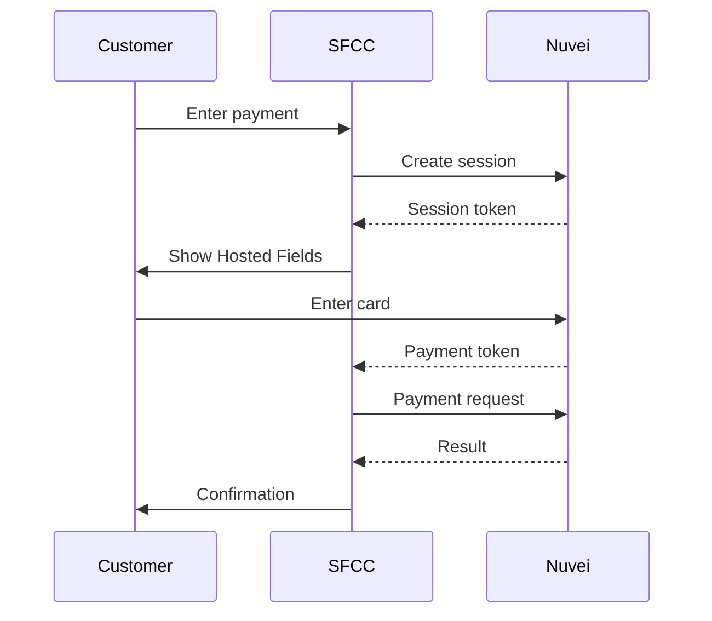

# Salesforce Commerce Cloud

<Info>
  **Platform:** Salesforce Commerce Cloud (SFCC) / Demandware  
  **Cartridge Version:** 3.x  
  **Architecture:** SFRA compatible  
  **Support:** Enterprise payment features
</Info>

Integrate Nuvei payments into Salesforce Commerce Cloud with our certified cartridge, supporting all payment methods and enterprise features.

## Features

<CardGroup cols={2}>
  <Card title="SFRA Compatible" icon="layer-group">
    Works with Storefront Reference Architecture
  </Card>
  <Card title="All Payment Methods" icon="credit-card">
    Cards, APMs, wallets, BNPL
  </Card>
  <Card title="Multi-site" icon="sitemap">
    Different configs per site
  </Card>
  <Card title="Order Management" icon="list-check">
    Full OMS integration
  </Card>
</CardGroup>

## Requirements

- SFCC SFRA 5.x or later
- Node.js 14+
- Nuvei enterprise merchant account
- SFCC Business Manager access

## Installation

### 1. Upload Cartridge

```bash
# Clone cartridge repository
git clone https://github.com/nuvei/sfcc-cartridge

# Upload to SFCC
npm run upload -- --instance your-instance
```

### 2. Add to Cartridge Path

In Business Manager:

1. Go to **Administration** → **Sites** → **Manage Sites**
2. Select your site
3. Go to **Settings**
4. Add `int_nuvei` to cartridge path:

```
int_nuvei:app_storefront_base
```

### 3. Import Metadata

1. Go to **Administration** → **Site Development** → **Import & Export**
2. Import `metadata/site_import.xml`

## Configuration

### Business Manager Settings

Navigate to **Merchant Tools** → **Site Preferences** → **Nuvei**

| Setting | Description |
|---------|-------------|
| Merchant ID | Your Nuvei merchant ID |
| Merchant Site ID | Your site ID |
| Secret Key | API secret key |
| Environment | Production / Sandbox |

### Payment Method Configuration

Enable Nuvei payment methods:

1. Go to **Merchant Tools** → **Ordering** → **Payment Methods**
2. Enable `NUVEI_CREDIT_CARD`
3. Enable additional APM methods as needed

### Payment Processors

Configure payment processors:

| Processor | Use Case |
|-----------|----------|
| NUVEI_CREDIT | Credit card payments |
| NUVEI_APM | Alternative payment methods |
| NUVEI_WALLET | Apple Pay, Google Pay |

## Checkout Integration

### SFRA Checkout Flow



### Controller Extension

```javascript
// cartridge/controllers/CheckoutServices.js
server.extend(module.superModule);

server.append('PlaceOrder', function (req, res, next) {
    var nuveiService = require('*/cartridge/scripts/nuvei/nuveiService');
    
    // Process Nuvei payment
    var paymentResult = nuveiService.processPayment(order);
    
    if (!paymentResult.success) {
        res.json({ error: true, message: paymentResult.message });
        return next();
    }
    
    return next();
});
```

## Jobs Configuration

### Transaction Sync Job

Schedule regular sync with Nuvei:

| Job | Schedule | Purpose |
|----|----------|---------|
| NuveiTransactionSync | Every 15 min | Sync payment status |
| NuveiSettlementReport | Daily | Settlement reconciliation |

## Multi-Site Configuration

Configure different Nuvei settings per site:

1. Go to **Sites** → Select site
2. Configure site-specific preferences
3. Each site can have different:
   - Merchant credentials
   - Payment methods
   - Currencies

## Order Management

### Capture

```javascript
// In OMS or custom script
var nuveiService = require('*/cartridge/scripts/nuvei/nuveiService');
nuveiService.capturePayment(order, amount);
```

### Refund

```javascript
nuveiService.refundPayment(order, amount);
```

### Void

```javascript
nuveiService.voidPayment(order);
```

## Testing

### Sandbox Configuration

1. Set Environment to `Sandbox`
2. Use sandbox credentials
3. Test with Nuvei test cards

### Test Cards

| Card | Number | Result |
|------|--------|--------|
| Visa | 4000 0000 0000 1026 | Approved |
| 3DS | 4000 0000 0000 1091 | 3DS flow |

## Troubleshooting

<AccordionGroup>
  <Accordion title="Cartridge not loading" icon="puzzle-piece">
    - Verify cartridge path order
    - Clear SFCC cache
    - Check cartridge uploaded correctly
  </Accordion>
  
  <Accordion title="Payment errors" icon="xmark">
    - Check Business Manager logs
    - Verify API credentials
    - Review Nuvei error codes
  </Accordion>
  
  <Accordion title="Job failures" icon="clock">
    - Check job logs in Business Manager
    - Verify API connectivity
    - Review job configuration
  </Accordion>
</AccordionGroup>

## Support

<CardGroup cols={2}>
  <Card title="Nuvei Docs" icon="book" href="https://docs.nuvei.com">
    API documentation
  </Card>
  <Card title="SFCC Docs" icon="cloud" href="https://documentation.b2c.commercecloud.salesforce.com">
    SFCC documentation
  </Card>
</CardGroup>
