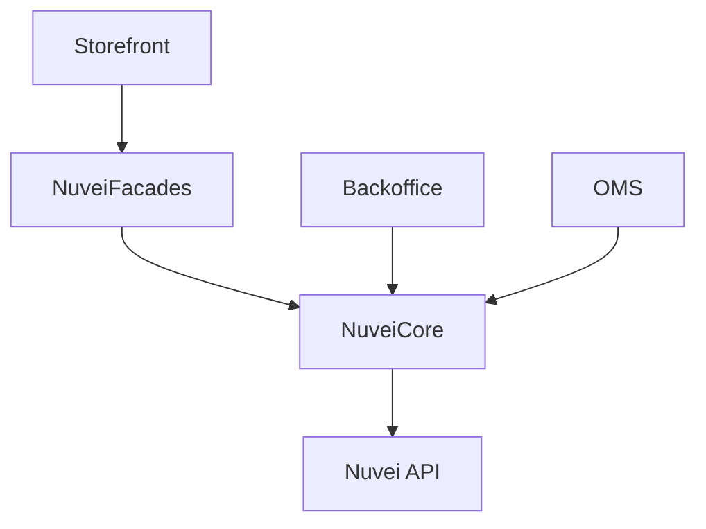

# SAP Commerce Cloud

<Info>
  **Platform:** SAP Commerce Cloud / Hybris 2105+  
  **Integration:** Extension  
  **Architecture:** Accelerator compatible  
  **Support:** Enterprise payment features
</Info>

Integrate Nuvei payments into SAP Commerce Cloud with our certified extension, supporting B2B, B2C, and marketplace scenarios.

## Features

<CardGroup cols={2}>
  <Card title="B2B & B2C" icon="building">
    Support for all commerce types
  </Card>
  <Card title="Multi-channel" icon="store">
    Web, mobile, call center
  </Card>
  <Card title="Payment Orchestration" icon="shuffle">
    Multiple PSPs, routing rules
  </Card>
  <Card title="Order Management" icon="list-check">
    Full OMS integration
  </Card>
</CardGroup>

## Requirements

- SAP Commerce Cloud 2105+
- Java 11+
- Nuvei enterprise merchant account
- SAP Commerce Admin access

## Installation

### 1. Add Extension

Add to `localextensions.xml`:

```xml
<extension name="nuveicore" />
<extension name="nuveifacades" />
<extension name="nuveiaddon" />
<extension name="nuveibackoffice" />
```

### 2. Build & Deploy

```bash
# Build extension
ant clean all

# Initialize system update
ant initialize
```

### 3. Add to Storefront

Add addon to your storefront:

```bash
ant addoninstall -Daddonnames="nuveiaddon" -DaddonStorefront.yacceleratorstorefront="your-storefront"
```

## Configuration

### Backoffice Settings

Navigate to **Nuvei** → **Configuration**

| Setting | Description |
|---------|-------------|
| Merchant ID | Your Nuvei merchant ID |
| Merchant Site ID | Your site ID |
| Secret Key | API secret key |
| Environment | Production / Sandbox |

### Payment Mode Configuration

Create payment modes for Nuvei:

```impex
INSERT_UPDATE NuveiPaymentMode; code[unique=true]; name[lang=en]; active
; nuveiCard ; Credit Card (Nuvei) ; true
; nuveiAPM ; Alternative Payment Methods ; true
; nuveiWallet ; Digital Wallets ; true
```

### Base Store Configuration

Configure per base store:

```impex
UPDATE BaseStore; uid[unique=true]; paymentProvider
; yourstore ; nuvei
```

## Architecture



## Checkout Integration

### Accelerator Checkout

The addon integrates with standard Accelerator checkout:

1. Customer selects payment
2. Hosted Fields render
3. Payment processed
4. Order placed

### Custom Checkout

For custom implementations:

```java
// Inject NuveiPaymentService
@Resource
private NuveiPaymentService nuveiPaymentService;

// Process payment
PaymentTransactionEntryModel entry = nuveiPaymentService.authorize(
    orderModel, 
    paymentInfoModel, 
    amount
);
```

## Order Management

### Capture

```java
nuveiPaymentService.capture(orderModel, amount);
```

### Refund

```java
nuveiPaymentService.refund(orderModel, amount);
```

### Cancel

```java
nuveiPaymentService.voidAuthorization(orderModel);
```

## B2B Features

### Credit Limits

Integrate with SAP B2B credit:

```java
// Check credit before Nuvei auth
if (b2bCreditService.hasAvailableCredit(customer, amount)) {
    nuveiPaymentService.authorize(order);
}
```

### Purchase Orders

Support PO numbers with Nuvei:

```impex
INSERT_UPDATE NuveiPaymentInfo; code[unique=true]; poNumber
; order123 ; PO-2024-001
```

## Multi-Site

Configure different settings per site:

| Site | Merchant ID | Currency |
|------|-------------|----------|
| US Site | 12345 | USD |
| EU Site | 67890 | EUR |

## Cronjobs

Schedule payment jobs:

| Job | Schedule | Purpose |
|----|----------|---------|
| NuveiStatusSyncJob | */15 * * * * | Sync payment status |
| NuveiSettlementJob | 0 2 * * * | Settlement report |

## Testing

### Sandbox Mode

1. Set Environment to `Sandbox`
2. Use test credentials
3. Process test orders

### Integration Tests

```java
@Test
public void testNuveiAuthorization() {
    PaymentTransactionEntryModel entry = nuveiPaymentService.authorize(
        testOrder, testPaymentInfo, BigDecimal.TEN
    );
    assertEquals(TransactionStatus.ACCEPTED, entry.getTransactionStatus());
}
```

## Troubleshooting

<AccordionGroup>
  <Accordion title="Extension not loading" icon="puzzle-piece">
    - Verify extension in localextensions.xml
    - Run ant clean all
    - Check server logs
  </Accordion>
  
  <Accordion title="Payment failures" icon="xmark">
    - Check Backoffice logs
    - Verify API credentials
    - Review Nuvei response codes
  </Accordion>
  
  <Accordion title="Addon not rendering" icon="eye-slash">
    - Verify addon installed
    - Clear storefront cache
    - Check JSP includes
  </Accordion>
</AccordionGroup>

## Support

<CardGroup cols={2}>
  <Card title="Nuvei Docs" icon="book" href="https://docs.nuvei.com">
    API documentation
  </Card>
  <Card title="SAP Help" icon="cloud" href="https://help.sap.com/commerce-cloud">
    SAP Commerce documentation
  </Card>
</CardGroup>
