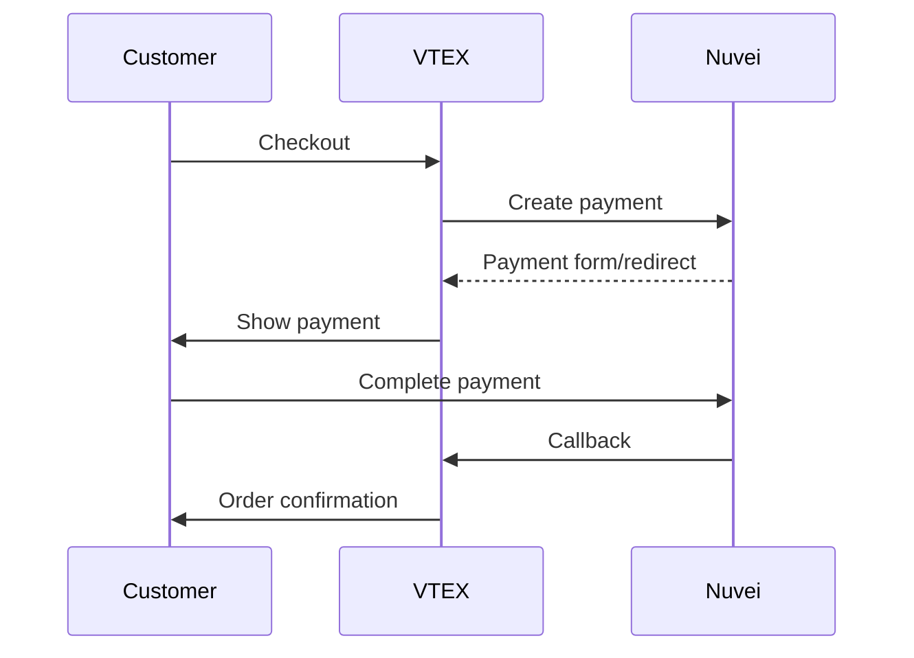

# VTEX Integration

<Info>
  **Platform:** VTEX IO / Legacy  
  **Type:** Payment connector  
  **Region:** Strong in Latin America  
  **Support:** Cards, APMs, local methods
</Info>

Integrate Nuvei payments into VTEX for unified commerce across Latin America and global markets.

## Features

<CardGroup cols={2}>
  <Card title="LATAM Payments" icon="earth-americas">
    PIX, Boleto, OXXO, local cards
  </Card>
  <Card title="Multi-seller" icon="store">
    Marketplace payment split
  </Card>
  <Card title="Omnichannel" icon="devices">
    Online, in-store, mobile
  </Card>
  <Card title="Anti-fraud" icon="shield">
    Integrated risk assessment
  </Card>
</CardGroup>

## Requirements

- VTEX account with Payment admin access
- Nuvei merchant account
- VTEX IO if using modern architecture

## Installation

### VTEX Admin Setup

1. Go to **Store Settings** → **Payments** → **Settings**
2. Click **Gateway Affiliations** → **+**
3. Select **Nuvei**
4. Configure credentials

### Configuration

| Field | Description |
|-------|-------------|
| Merchant ID | Your Nuvei merchant ID |
| Merchant Site ID | Your site ID |
| Secret Key | API secret key |
| Environment | Production / Sandbox |

## Payment Conditions

Create payment conditions for Nuvei methods:

1. Go to **Payment Conditions** → **+**
2. Select payment method (Credit Card, PIX, etc.)
3. Choose **Nuvei** as gateway
4. Configure rules

### Credit Cards

```
Payment Condition: Credit Card
Gateway: Nuvei
Installments: Up to 12x
Interest: As configured
```

### PIX (Brazil)

```
Payment Condition: PIX
Gateway: Nuvei
Country: Brazil
Currency: BRL
```

### Boleto (Brazil)

```
Payment Condition: Boleto Bancário
Gateway: Nuvei
Country: Brazil
Currency: BRL
```

## Checkout Flow



## Marketplace Split

Configure payment split for marketplace:

```json
{
  "paymentSplit": {
    "seller1": {
      "amount": 70,
      "account": "seller1_nuvei_id"
    },
    "seller2": {
      "amount": 30,
      "account": "seller2_nuvei_id"
    }
  }
}
```

## Anti-Fraud Integration

Enable Nuvei fraud protection:

1. Go to **Gateway Affiliations** → **Nuvei**
2. Enable **Anti-fraud**
3. Configure rules

## Transaction Management

### View Transactions

1. Go to **Orders** → **Transactions**
2. Filter by gateway: Nuvei
3. View transaction details

### Manual Actions

| Action | When to Use |
|--------|-------------|
| Capture | After shipping (if auth only) |
| Refund | Customer returns |
| Cancel | Before capture |

## Installments

Configure Brazilian installments (parcelamento):

| Installments | Interest | Min Amount |
|--------------|----------|------------|
| 1x | 0% | R$10 |
| 2-6x | 0% | R$50 |
| 7-12x | 1.99% | R$100 |

## Testing

1. Set Environment to **Sandbox**
2. Use VTEX test store
3. Process test orders with Nuvei test cards

## Troubleshooting

<AccordionGroup>
  <Accordion title="Gateway not appearing" icon="eye-slash">
    - Check gateway affiliation active
    - Verify credentials correct
    - Clear VTEX cache
  </Accordion>
  
  <Accordion title="Payment declined" icon="xmark">
    - Check anti-fraud rules
    - Verify payment condition rules
    - Review Nuvei logs
  </Accordion>
  
  <Accordion title="Callback issues" icon="rotate">
    - Verify VTEX endpoint accessible
    - Check Nuvei webhook config
    - Review VTEX transaction logs
  </Accordion>
</AccordionGroup>

## Support

<CardGroup cols={2}>
  <Card title="Nuvei Docs" icon="book" href="https://docs.nuvei.com">
    API documentation
  </Card>
  <Card title="VTEX Help" icon="cloud" href="https://help.vtex.com">
    VTEX documentation
  </Card>
</CardGroup>
