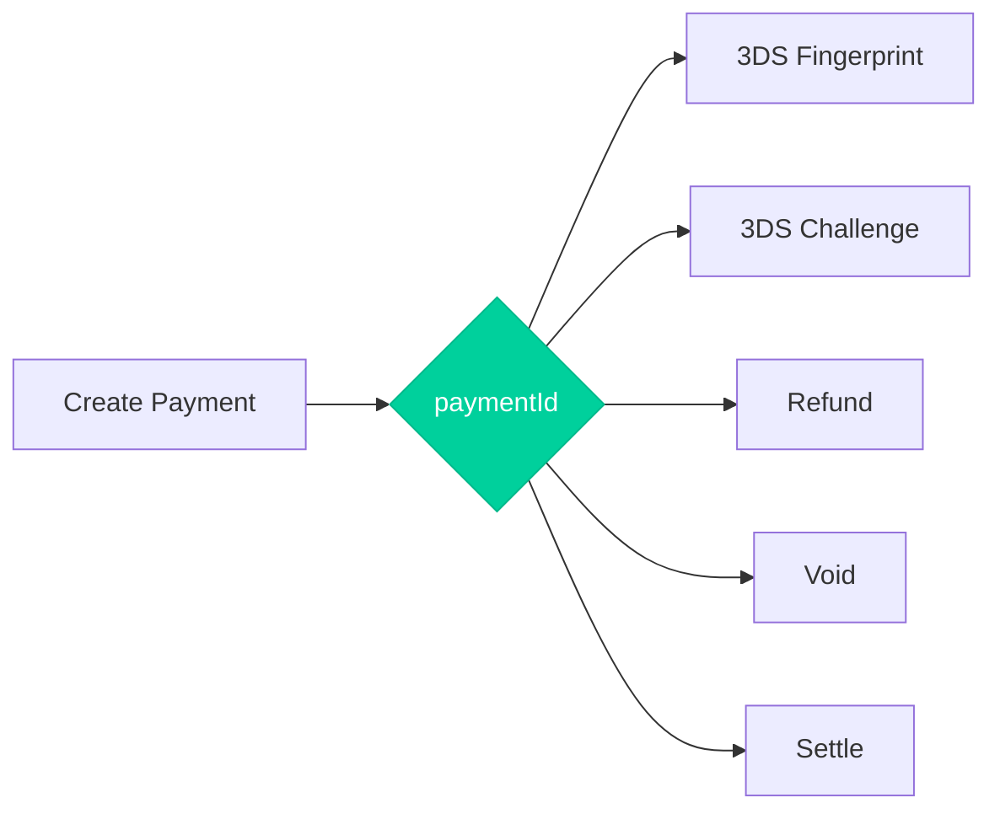

# Record IDs & Payment Lifecycle

REST API 2.0 uses a unified `paymentId` to link all operations within a payment lifecycle.

## The Payment ID

When you create a payment, you receive a `paymentId`:

```json
{
  "paymentId": "abc123",
  "transactionId": "2110000000010964089",
  "result": {
    "status": "approved"
  }
}
```

This `paymentId` is used for all subsequent operations on that payment.

## Payment Lifecycle



## Operations Using Payment ID

### Initial Payment
```bash
POST /payment-api/payments
# Returns: paymentId: "abc123"
```

### 3DS Fingerprint
```bash
POST /payment-api/payments/abc123/fingerprint
```

### 3DS Challenge
```bash
POST /payment-api/payments/abc123/challenge
```

### Refund
```bash
POST /payment-api/payments/abc123/refunds
```

### Void
```bash
POST /payment-api/payments/abc123/voids
```

### Settle
```bash
POST /payment-api/payments/abc123/settles
```

## Benefits

<AccordionGroup>
  <Accordion title="Simplified requests" icon="feather">
    No need to repeat all payment details in follow-up requests. Just reference the `paymentId`:
    
    ```json
    // Refund request - only need essential details
    {
      "processingEntityId": "pe_12345",
      "amount": 50,
      "currency": "USD"
    }
    ```
  </Accordion>
  
  <Accordion title="Transaction linking" icon="link">
    All operations are automatically linked:
    - Original payment
    - 3DS authentication steps
    - Refunds (full or partial)
    - Voids
    - Settlements
  </Accordion>
  
  <Accordion title="Easier reconciliation" icon="magnifying-glass">
    Use `paymentId` to track the complete history of a payment across all operations.
  </Accordion>
</AccordionGroup>

## ID Reference

| ID | Description | Format |
|----|-------------|--------|
| `paymentId` | Links all operations | String (e.g., `abc123`) |
| `transactionId` | Nuvei transaction reference | Numeric string |
| `externalTransactionId` | External reference | Numeric string |
| `merchantTransactionId` | Your reference | Your format |
| `buyerId` | Customer identifier | Your format |

<Tip>
  Always store the `paymentId` in your database to enable refunds, voids, and transaction lookups.
</Tip>
