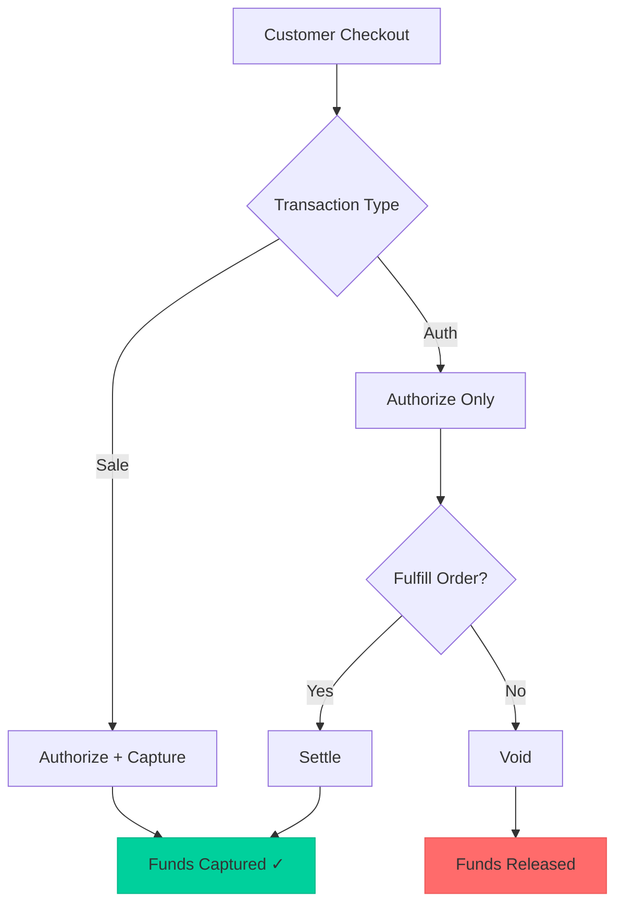

# Transaction Types

Choose the right transaction type based on your business flow.

## Available Types

| Type | Description | Captures Funds |
|------|-------------|----------------|
| `Sale` | Authorize and capture in one step | Yes, immediately |
| `Auth` | Authorization only | No, requires settle |

## Sale vs Auth

<Tabs>
  <Tab title="Sale (Recommended)">
    **Use when:** You can fulfill the order immediately
    
    - Single API call
    - Funds captured immediately
    - Simpler integration
    
    ```json
    {
      "transactionType": "Sale",
      "amount": 100,
      "currency": "USD"
    }
    ```
    
    **Best for:**
    - Digital goods
    - Immediate delivery
    - Services
  </Tab>
  <Tab title="Auth + Settle">
    **Use when:** You need to verify inventory or delay capture
    
    - Two API calls (Auth → Settle)
    - Funds held but not captured
    - Can void if needed
    
    ```json
    // Step 1: Authorize
    {
      "transactionType": "Auth",
      "amount": 100,
      "currency": "USD"
    }
    
    // Step 2: Settle (later)
    POST /payments/{paymentId}/settles
    {
      "processingEntityId": "pe_12345"
    }
    ```
    
    **Best for:**
    - Physical goods (ship then capture)
    - Reservations
    - Pre-orders
  </Tab>
</Tabs>

## Transaction Flow Diagram



## 3DS Transaction Types

During 3DS authentication, you'll see these internal types:

| Type | Description |
|------|-------------|
| `InitAuth3D` | Initial 3DS authentication request |
| `Auth3D` | 3DS challenge authentication |

These are handled automatically—you still specify `Sale` or `Auth` in your request.

## Choosing the Right Type

<CardGroup cols={2}>
  <Card title="Use Sale" icon="bolt">
    - Digital products
    - Subscriptions
    - Immediate fulfillment
    - Simplicity preferred
  </Card>
  <Card title="Use Auth" icon="clock">
    - Physical goods
    - Travel bookings
    - Pre-orders
    - Inventory verification needed
  </Card>
</CardGroup>

<Warning>
  Authorizations expire after 7-30 days (varies by card network). Settle within this window or the auth will be released.
</Warning>
