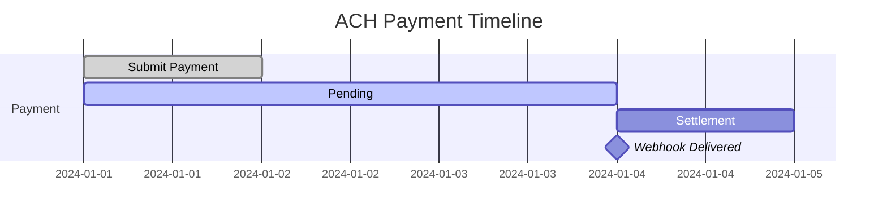

# ACH Bank Transfers

Accept ACH (Automated Clearing House) payments directly from US bank accounts.

## Overview

<CardGroup cols={2}>
  <Card title="Lower Fees" icon="percent">
    Typically lower than card processing fees
  </Card>
  <Card title="High-Value Payments" icon="sack-dollar">
    Ideal for B2B and large transactions
  </Card>
</CardGroup>

## ACH Payment Request

<Tabs>
  <Tab title="cURL">
```bash
curl -X POST https://api-sandbox.nuvei.com/payment-api/payments \
  -H "Content-Type: application/json" \
  -H "x-api-key: YOUR_API_KEY" \
  -d '{
    "processingEntityId": "1234567890",
    "transactionType": "Sale",
    "amount": 500,
    "currency": "USD",
    "paymentMethod": {
      "type": "ach",
      "ach": {
        "accountNumber": "1234567890",
        "routingNumber": "021000021",
        "accountType": "checking",
        "accountHolderName": "John Smith"
      }
    },
    "buyerDetails": {
      "firstName": "John",
      "lastName": "Smith",
      "email": "john@example.com"
    }
  }'
```
  </Tab>
  <Tab title="JavaScript">
```javascript
const response = await fetch('https://api-sandbox.nuvei.com/payment-api/payments', {
  method: 'POST',
  headers: {
    'Content-Type': 'application/json',
    'x-api-key': 'YOUR_API_KEY'
  },
  body: JSON.stringify({
    processingEntityId: '1234567890',
    transactionType: 'Sale',
    amount: 500,
    currency: 'USD',
    paymentMethod: {
      type: 'ach',
      ach: {
        accountNumber: '1234567890',
        routingNumber: '021000021',
        accountType: 'checking',
        accountHolderName: 'John Smith'
      }
    },
    buyerDetails: {
      firstName: 'John',
      lastName: 'Smith',
      email: 'john@example.com'
    }
  })
});

const result = await response.json();
```
  </Tab>
</Tabs>

## Response

```json
{
  "paymentId": "375011",
  "transactionId": "2110000000010964089",
  "amount": 500,
  "currency": "USD",
  "transactionType": "Sale",
  "result": {
    "status": "pending"
  },
  "paymentMethod": {
    "type": "ach",
    "ach": {
      "last4Digits": "7890",
      "accountType": "checking",
      "bankName": "Chase"
    }
  }
}
```

<Note>
  ACH payments initially return `status: pending`. The final status is delivered via webhook after settlement (2-5 business days).
</Note>

## Request Parameters

| Parameter | Type | Required | Description |
|-----------|------|----------|-------------|
| `paymentMethod.type` | string | ✓ | Must be `ach` |
| `ach.accountNumber` | string | ✓ | Bank account number |
| `ach.routingNumber` | string | ✓ | 9-digit ABA routing number |
| `ach.accountType` | string | ✓ | `checking` or `savings` |
| `ach.accountHolderName` | string | ✓ | Name on the account |

## Account Types

| Type | Description |
|------|-------------|
| `checking` | Checking account (most common) |
| `savings` | Savings account |

## ACH Settlement Timeline



| Day | Status |
|-----|--------|
| Day 1 | Payment submitted → `pending` |
| Day 2-4 | Processing through ACH network |
| Day 5 | Settlement → `approved` or `declined` |

## Handling ACH Webhooks

ACH final status comes via webhook:

```json
{
  "eventType": "payment.completed",
  "paymentId": "375011",
  "result": {
    "status": "approved"
  }
}
```

Or if declined:

```json
{
  "eventType": "payment.failed",
  "paymentId": "375011",
  "result": {
    "status": "declined",
    "reason": {
      "code": "INSUFFICIENT_FUNDS",
      "message": "Insufficient funds in account"
    }
  }
}
```

## ACH Return Codes

| Code | Description |
|------|-------------|
| R01 | Insufficient funds |
| R02 | Account closed |
| R03 | No account / unable to locate |
| R04 | Invalid account number |
| R10 | Customer advises not authorized |
| R29 | Corporate customer advises not authorized |

## Best Practices

<AccordionGroup>
  <Accordion title="Verify bank account" icon="building-columns">
    Consider micro-deposit verification for new accounts to reduce return rates.
  </Accordion>
  
  <Accordion title="Set up webhooks" icon="webhook">
    ACH requires webhooks for final status—don't rely on the initial API response.
  </Accordion>
  
  <Accordion title="Handle returns gracefully" icon="rotate-left">
    Returns can occur up to 60 days later. Have a process to handle them.
  </Accordion>
  
  <Accordion title="Clearly communicate timing" icon="clock">
    Tell customers that ACH takes 2-5 business days to complete.
  </Accordion>
</AccordionGroup>

<Warning>
  ACH is only available for USD transactions within the United States.
</Warning>
