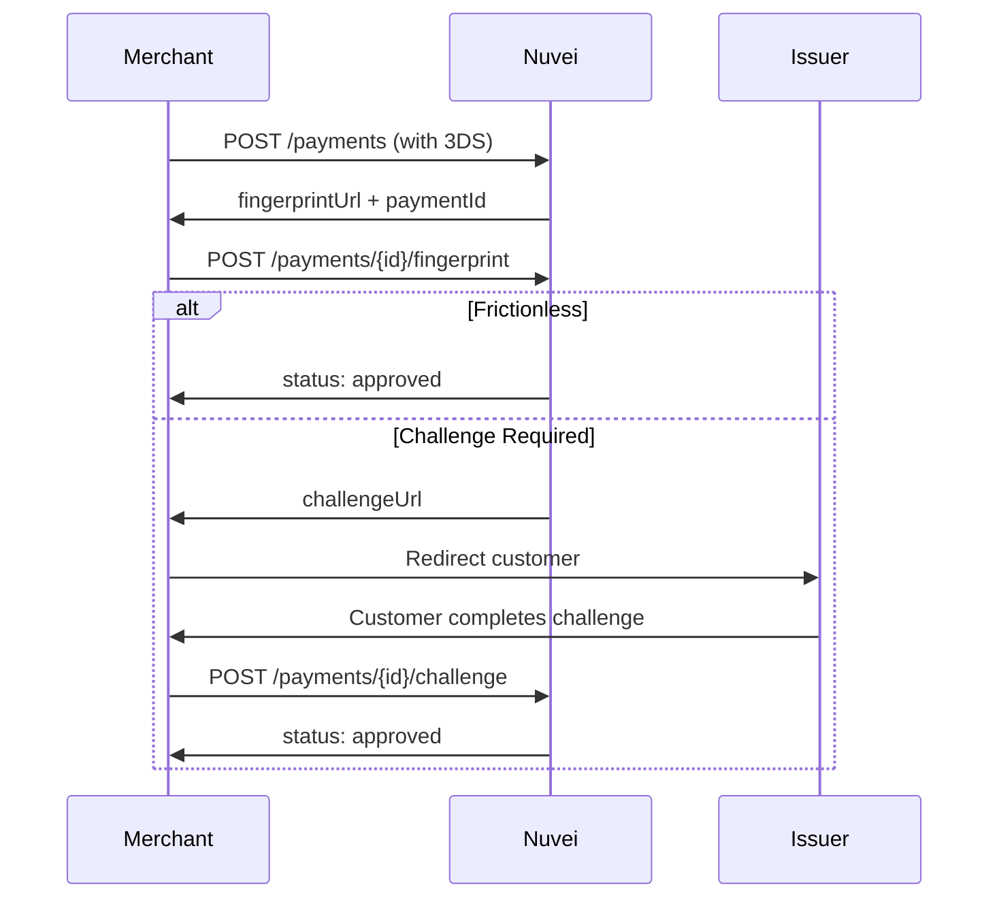

# 3D Secure Payments

3D Secure (3DS) adds an extra authentication layer, reducing fraud and shifting liability.

## Benefits

<CardGroup cols={2}>
  <Card title="Fraud Reduction" icon="shield-halved">
    Card issuer authenticates the customer
  </Card>
  <Card title="Liability Shift" icon="scale-balanced">
    Fraud liability shifts to the issuer
  </Card>
  <Card title="Regulatory Compliance" icon="gavel">
    Required in EU (SCA), UK, and other regions
  </Card>
  <Card title="Higher Approval Rates" icon="chart-line">
    Issuers may approve more transactions
  </Card>
</CardGroup>

## 3DS Flow Overview



## Step 1: Initial Payment Request

```bash
curl -X POST https://api-sandbox.nuvei.com/payment-api/payments \
  -H "Content-Type: application/json" \
  -H "x-api-key: YOUR_API_KEY" \
  -d '{
    "processingEntityId": "1234567890",
    "transactionType": "Sale",
    "amount": 100,
    "currency": "USD",
    "paymentMethod": {
      "type": "card",
      "card": {
        "cardNumber": "4000027891380961",
        "expirationMonth": "12",
        "expirationYear": "2030",
        "cvv": "217",
        "cardHolderName": "John Smith"
      },
      "threeD": {
        "challengePreference": "noPreference"
      }
    },
    "buyerDetails": {
      "email": "john@example.com"
    },
    "urlDetails": {
      "notificationUrl": "https://yoursite.com/webhook"
    }
  }'
```

### Initial Response

```json
{
  "paymentId": "375011",
  "transactionType": "InitAuth3D",
  "result": {
    "status": "pending"
  },
  "threeD": {
    "fingerprintUrl": "https://3ds.nuvei.com/fingerprint/abc123",
    "methodCompletionInd": "U"
  }
}
```

## Step 2: Fingerprint Request

After the customer's browser loads the fingerprint URL (invisible to user):

```bash
curl -X POST https://api-sandbox.nuvei.com/payment-api/payments/375011/fingerprint \
  -H "Content-Type: application/json" \
  -H "x-api-key: YOUR_API_KEY" \
  -d '{
    "processingEntityId": "1234567890"
  }'
```

### Fingerprint Response

<Tabs>
  <Tab title="Frictionless (Approved)">
```json
{
  "paymentId": "375011",
  "result": {
    "status": "approved"
  },
  "authCode": "300250",
  "threeD": {
    "authenticationStatus": "Y",
    "flow": "frictionless"
  }
}
```
**Done!** No further action needed.
  </Tab>
  <Tab title="Challenge Required">
```json
{
  "paymentId": "375011",
  "result": {
    "status": "pending"
  },
  "threeD": {
    "challengeUrl": "https://issuer.com/challenge?id=xyz",
    "acsUrl": "https://issuer.com/acs",
    "cReq": "eyJhY3NUcmFuc0lEI...",
    "flow": "challenge"
  }
}
```
**Redirect customer** to `challengeUrl`
  </Tab>
</Tabs>

## Step 3: Challenge Completion

After the customer completes the challenge on the issuer's page:

```bash
curl -X POST https://api-sandbox.nuvei.com/payment-api/payments/375011/challenge \
  -H "Content-Type: application/json" \
  -H "x-api-key: YOUR_API_KEY" \
  -d '{
    "processingEntityId": "1234567890"
  }'
```

### Final Response

```json
{
  "paymentId": "375011",
  "transactionId": "2110000000010964089",
  "amount": 100,
  "currency": "USD",
  "transactionType": "Sale",
  "result": {
    "status": "approved"
  },
  "authCode": "300250",
  "threeD": {
    "authenticationStatus": "Y",
    "flow": "challenge"
  }
}
```

## Challenge Preferences

| Value | Description |
|-------|-------------|
| `noPreference` | Let issuer decide (recommended) |
| `challengeRequested` | Prefer challenge flow |
| `challengeMandated` | Require challenge |

## 3DS Authentication Statuses

| Status | Description | Result |
|--------|-------------|--------|
| `Y` | Authenticated | Proceed |
| `A` | Attempted | Proceed (liability may vary) |
| `N` | Not authenticated | Decline |
| `U` | Unable to authenticate | Merchant decision |
| `R` | Rejected | Decline |

<Tip>
  For testing, use card number `4000027891380961` which triggers the full 3DS challenge flow.
</Tip>
