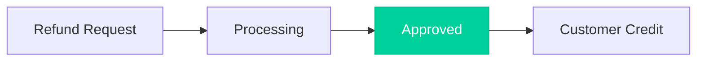

# Refunds

Return funds to customers by refunding settled payments.

## When to Refund

- Customer returns a product
- Service cancellation
- Dispute resolution
- Price adjustment

<Note>
  Refunds are only available for **settled** payments. For pending authorizations, use [void](/guides/operations/voids) instead.
</Note>

## Full Refund

<Tabs>
  <Tab title="cURL">
```bash
curl -X POST https://api-sandbox.nuvei.com/payment-api/payments/375011/refunds \
  -H "Content-Type: application/json" \
  -H "x-api-key: YOUR_API_KEY" \
  -d '{
    "processingEntityId": "1234567890",
    "amount": 100,
    "currency": "USD"
  }'
```
  </Tab>
  <Tab title="JavaScript">
```javascript
const response = await fetch(
  'https://api-sandbox.nuvei.com/payment-api/payments/375011/refunds',
  {
    method: 'POST',
    headers: {
      'Content-Type': 'application/json',
      'x-api-key': 'YOUR_API_KEY'
    },
    body: JSON.stringify({
      processingEntityId: '1234567890',
      amount: 100,
      currency: 'USD'
    })
  }
);

const result = await response.json();
```
  </Tab>
  <Tab title="Python">
```python
import requests

response = requests.post(
    'https://api-sandbox.nuvei.com/payment-api/payments/375011/refunds',
    headers={
        'Content-Type': 'application/json',
        'x-api-key': 'YOUR_API_KEY'
    },
    json={
        'processingEntityId': '1234567890',
        'amount': 100,
        'currency': 'USD'
    }
)

result = response.json()
```
  </Tab>
</Tabs>

## Partial Refund

Refund only a portion of the original amount:

```bash
curl -X POST https://api-sandbox.nuvei.com/payment-api/payments/375011/refunds \
  -H "Content-Type: application/json" \
  -H "x-api-key: YOUR_API_KEY" \
  -d '{
    "processingEntityId": "1234567890",
    "amount": 25,
    "currency": "USD"
  }'
```

<Tip>
  You can perform multiple partial refunds on the same payment until the full amount is refunded.
</Tip>

## Response

```json
{
  "paymentId": "375011",
  "transactionId": "2110000000010964090",
  "amount": 100,
  "currency": "USD",
  "transactionType": "Credit",
  "result": {
    "status": "approved"
  }
}
```

## Request Parameters

| Parameter | Type | Required | Description |
|-----------|------|----------|-------------|
| `processingEntityId` | string | ✓ | Your merchant ID |
| `amount` | number | ✓ | Refund amount (≤ original amount) |
| `currency` | string | ✓ | Must match original payment |
| `comment` | string | | Internal note |

## Refund Rules

| Rule | Description |
|------|-------------|
| Amount limit | Cannot exceed remaining refundable amount |
| Currency | Must match original payment currency |
| Timing | Available after settlement (immediate for Sale) |
| Multiple | Multiple partial refunds allowed |

## Refund Timeline



| Step | Timeline |
|------|----------|
| API Response | Immediate |
| Processing | 1-2 business days |
| Customer credit | 5-10 business days |

## Error Handling

```json
{
  "error": {
    "code": "INVALID_AMOUNT",
    "message": "Refund amount exceeds available amount",
    "details": {
      "requestedAmount": 150,
      "availableAmount": 100
    }
  }
}
```

**Common errors:**
- Amount exceeds available balance
- Payment not yet settled
- Payment already fully refunded
