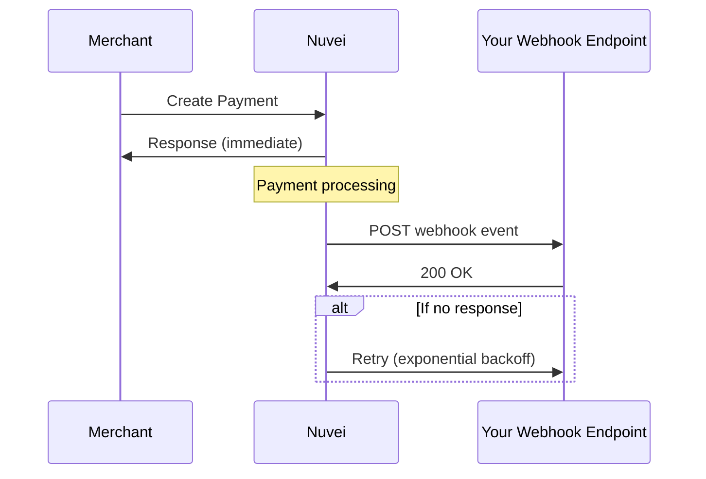

# Webhooks

Receive real-time notifications when payment events occur.

## Why Webhooks?

<CardGroup cols={2}>
  <Card title="Real-Time Updates" icon="bolt">
    Get notified instantly when payments complete
  </Card>
  <Card title="Asynchronous Events" icon="clock">
    Handle ACH settlements and chargebacks
  </Card>
  <Card title="Reliable Delivery" icon="rotate">
    Automatic retries with exponential backoff
  </Card>
  <Card title="Secure" icon="shield-check">
    Signature verification for authenticity
  </Card>
</CardGroup>

## Event Types

| Event | Description |
|-------|-------------|
| `payment.completed` | Payment successfully processed |
| `payment.failed` | Payment declined or failed |
| `payment.pending` | Payment awaiting processing |
| `refund.completed` | Refund successfully processed |
| `chargeback.created` | Chargeback initiated |
| `chargeback.updated` | Chargeback status changed |

## Webhook Payload

```json
{
  "eventId": "evt_abc123",
  "eventType": "payment.completed",
  "createdAt": "2024-01-15T10:30:00Z",
  "data": {
    "paymentId": "375011",
    "transactionId": "2110000000010964089",
    "amount": 100,
    "currency": "USD",
    "transactionType": "Sale",
    "result": {
      "status": "approved"
    },
    "paymentMethod": {
      "type": "card",
      "card": {
        "bin": "400002",
        "last4Digits": "0961",
        "cardBrand": "VISA"
      }
    }
  }
}
```

## Configuration

### Set Notification URL

Include `notificationUrl` in your payment request:

```json
{
  "processingEntityId": "1234567890",
  "transactionType": "Sale",
  "amount": 100,
  "currency": "USD",
  "urlDetails": {
    "notificationUrl": "https://yoursite.com/webhooks/nuvei"
  },
  "paymentMethod": { ... }
}
```

### Or Configure Globally

Set a default webhook URL in the Nuvei Control Panel for all transactions.

## Webhook Flow



## Retry Policy

If your endpoint doesn't respond with `2xx`, Nuvei retries:

| Attempt | Delay |
|---------|-------|
| 1st retry | 5 minutes |
| 2nd retry | 30 minutes |
| 3rd retry | 2 hours |
| 4th retry | 8 hours |
| 5th retry | 24 hours |

<Warning>
  After 5 failed attempts, the webhook is marked as failed. Check your logs and manually reconcile.
</Warning>

## Required Response

Your endpoint must:
- Return HTTP `200` or `2xx` status
- Respond within 30 seconds
- Be idempotent (handle duplicate deliveries)

```javascript
app.post('/webhooks/nuvei', (req, res) => {
  // Process webhook
  handleWebhookEvent(req.body);
  
  // Always respond 200
  res.status(200).send('OK');
});
```

<Card title="Next: Handling Webhooks" icon="code" href="/guides/webhooks/handling">
  Learn how to securely process webhook events
</Card>
